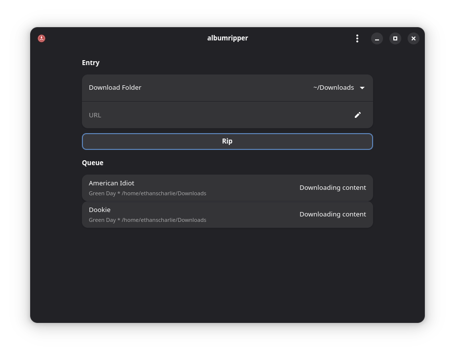

<h1>   Album Ripper</h1>

Download albums from YouTube Music with metadata

This project was build with the default Gnome builder tools and was written in python. It uses yt-dlp and mutagen to download youtube content, and to write metadata to downloaded content.
